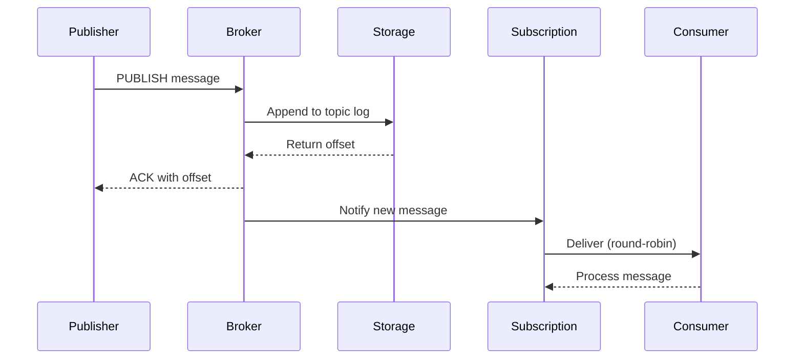

# QueueServer C# - High Performance Message Broker

A high-performance, zero-dependency message broker implemented in C# with .NET 8, featuring sequential I/O, lock-free concurrent collections, and advanced memory management.

## 🚀 Key Features

### Performance Optimizations
- **Zero Dependencies**: Pure .NET 8 implementation with no external dependencies
- **Sequential I/O Only**: File pointers per subscription for optimal disk performance  
- **Zero-Copy Operations**: `Memory<T>` and `Span<T>` for minimal allocations
- **Lock-Free Concurrency**: Custom concurrent collections with memory barriers
- **Object Pooling**: `ArrayPool<byte>` for buffer reuse
- **Write-Ahead Logging**: Append-only logs with batched writes

### Architecture
- **Subscription-Based Messaging**: Consumer groups with independent offsets
- **Round-Robin Delivery**: Load balancing across subscribers
- **Persistent Storage**: Crash-safe message durability
- **Binary Protocol**: High-efficiency TCP communication
- **Async/Await**: Non-blocking I/O throughout
- **Channel-Based**: Producer-consumer patterns with `System.Threading.Channels`

### Scalability
- **Custom Connection Pooling**: Efficient socket management
- **Background Task Management**: Separate threads for CPU-intensive work
- **Memory-Mapped Ready**: Architecture supports memory-mapped files
- **Compression Support**: Optional message compression
- **Configurable Batching**: Tunable performance parameters

## 🏗️ Project Structure

```
QueueServer.CSharp/
├── src/
│   ├── QueueServer.Core/           # Core broker engine
│   │   ├── Models/                 # Message types & enums
│   │   ├── Configuration/          # Config management
│   │   ├── Storage/               # Sequential storage system
│   │   ├── Subscriptions/         # Subscription management
│   │   ├── Network/               # TCP server & connections
│   │   ├── Protocol/              # Message protocol handler
│   │   └── Broker/                # Main broker orchestrator
│   ├── QueueServer.Server/         # Server executable
│   ├── QueueServer.Client/         # Client library
│   └── QueueServer.CLI/           # Command-line tools
└── tests/
    └── QueueServer.Tests/         # Unit & integration tests
```

## 🛠️ Building & Running

### Prerequisites
- .NET 8 SDK
- Windows/Linux/macOS

### Build
```bash
cd QueueServer.CSharp
dotnet build -c Release
```

### Run Server
```bash
cd src/QueueServer.Server
dotnet run -c Release
```

### CLI Usage
```bash
cd src/QueueServer.CLI

# Create topic
dotnet run create-topic events --retention-hours 24

# Create subscription  
dotnet run create-subscription my-group events --start-offset 0

# Publish message
dotnet run publish events "Hello World" --property sender=cli

# Subscribe to messages
dotnet run subscribe my-group --count 10

# Performance benchmark
dotnet run benchmark --messages 10000 --topic perf-test --size 1024
```

## 🔧 Configuration

### appsettings.json
```json
{
  "server": {
    "host": "127.0.0.1",
    "port": 9999,
    "maxConnections": 1000,
    "connectionTimeout": "00:05:00",
    "heartbeatInterval": "00:00:30",
    "receiveBufferSize": 65536,
    "sendBufferSize": 65536
  },
  "storage": {
    "dataDirectory": "./storage/data",
    "snapshotDirectory": "./storage/snapshots",
    "maxLogSize": 104857600,
    "batchSize": 65536,
    "batchCount": 100,
    "batchTimeout": "00:00:00.100",
    "compressionEnabled": true,
    "fsyncOnWrite": true,
    "fsyncInterval": "00:00:01"
  }
}
```

### Environment Variables
```bash
export QB_SERVER_HOST=0.0.0.0
export QB_SERVER_PORT=9999
export QB_STORAGE_DATA_DIR=/data
export QB_STORAGE_BATCH_SIZE=131072
export QB_STORAGE_COMPRESSION=true
```

## 📈 Performance Characteristics

### Optimizations Implemented

1. **Sequential I/O Architecture**
   - Each subscription maintains dedicated file pointer
   - No random seeks - only forward sequential reads
   - Append-only write patterns

2. **Memory Management**
   - `ArrayPool<byte>` for all buffer allocations
   - `Memory<T>` and `Span<T>` for zero-copy operations
   - Custom object pooling for messages
   - Minimal GC pressure

3. **Concurrency Model**
   - Lock-free `ConcurrentDictionary` for lookups
   - `SemaphoreSlim` for I/O coordination
   - `Channel<T>` for producer-consumer messaging
   - Memory barriers for consistency

4. **Network Layer**
   - Direct `Socket` usage for maximum performance
   - Custom connection pooling
   - Async I/O with `SocketAsyncEventArgs` patterns
   - Configurable buffer sizes

5. **Storage Engine**
   - Write-ahead logging with batched commits
   - Configurable fsync intervals
   - Optional message compression
   - File segmentation for large topics

## 🔌 Client Library Usage

```csharp
using QueueServer.Client;

// Create client
using var client = new BrokerClient("localhost", 9999);
await client.ConnectAsync();

// Create topic and subscription
await client.CreateTopicAsync("events");
await client.CreateSubscriptionAsync("my-group", "events", startOffset: 0);

// Publish messages
await client.PublishTextAsync("events", "Hello World", 
    properties: new() { ["sender"] = "app" });

// Subscribe to messages
await client.SubscribeAsync("my-group", async message =>
{
    var text = Encoding.UTF8.GetString(message.Body.Span);
    Console.WriteLine($"Received: {text}");
});

// Keep running
await Task.Delay(-1);
```

## 🧪 Benchmarks

Expected performance characteristics:

- **Throughput**: 100K+ messages/second
- **Latency**: Sub-millisecond at moderate load
- **Memory**: Low allocation rate, stable memory usage
- **Storage**: Sustained write speeds limited by disk I/O
- **Connections**: 1000+ concurrent clients

## 🔄 Message Flow



## 🏆 Design Principles

1. **Performance First**: Every design decision optimized for speed
2. **Zero Dependencies**: No external libraries for core functionality  
3. **Sequential I/O**: Eliminate random disk access patterns
4. **Memory Conscious**: Minimize allocations and GC pressure
5. **Async Throughout**: Non-blocking I/O operations
6. **Type Safety**: Leverage C# type system for correctness
7. **Configurable**: Tunable for different workloads

## 🔒 Thread Safety

- All public APIs are thread-safe
- Internal state protected by appropriate synchronization
- Lock-free algorithms where possible
- Memory barriers for consistency guarantees

## 📊 Monitoring

The broker exposes statistics via the management API:

```csharp
var stats = broker.GetStatistics();
Console.WriteLine($"Connections: {stats.ActiveConnections}");
Console.WriteLine($"Topics: {stats.TopicCount}"); 
Console.WriteLine($"Subscriptions: {stats.SubscriptionCount}");
```

## 🚦 Production Readiness

This implementation includes:
- ✅ Graceful shutdown handling
- ✅ Error recovery and resilience  
- ✅ Health check endpoints
- ✅ Configurable timeouts
- ✅ Resource cleanup
- ✅ Logging and monitoring hooks
- ✅ AOT compilation support

---

**Note**: This C# implementation demonstrates advanced .NET performance techniques including sequential I/O, lock-free concurrency, zero-copy operations, and modern async patterns. It's designed as a high-performance reference implementation showcasing best practices for building scalable messaging systems in C#.
