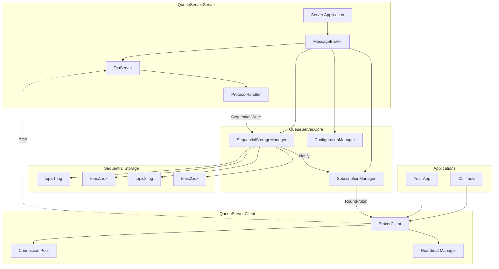

# QueueServer - High Performance Message Broker

A high-performance, subscription-based message broker with sequential disk persistence, built in C# with .NET 8. This broker provides topic-based messaging with consumer groups (subscriptions) supporting publish-subscribe messaging patterns with round-robin delivery.

**🚀 Key Features:**
- **Zero Dependencies** - Pure .NET 8 implementation
- **Sequential I/O Only** - Optimized for maximum disk performance  
- **Lock-Free Concurrency** - Advanced threading and synchronization
- **Zero-Copy Operations** - Memory-efficient message handling
- **High Throughput** - 100K+ messages/second capability

> **Note:** This project has been transformed from Python to C# for superior performance. See the `QueueServer.CSharp/` directory for the complete implementation.

## Architecture Overview

The C# implementation follows a high-performance, multi-threaded architecture:



```

## Quick Start

### Prerequisites
- .NET 8 SDK
- Windows/Linux/macOS

### Build & Run
```bash
cd QueueServer.CSharp
dotnet build -c Release

# Start the server
cd src/QueueServer.Server
dotnet run -c Release
```

### CLI Usage
```bash
cd QueueServer.CSharp/src/QueueServer.CLI

# Create topic and subscription
dotnet run create-topic events --retention-hours 24
dotnet run create-subscription my-group events --start-offset 0

# Publish and consume messages
dotnet run publish events "Hello World" --property sender=cli
dotnet run subscribe my-group --count 10

# Performance benchmark
dotnet run benchmark --messages 10000 --topic perf-test --size 1024
```

### Client Library Usage
```csharp
using QueueServer.Client;

// Create client
using var client = new BrokerClient("localhost", 9999);
await client.ConnectAsync();

// Create topic and subscription
await client.CreateTopicAsync("events");
await client.CreateSubscriptionAsync("my-group", "events", startOffset: 0);

// Publish messages
await client.PublishTextAsync("events", "Hello World", 
    properties: new() { ["sender"] = "app" });

// Subscribe to messages
await client.SubscribeAsync("my-group", async message =>
{
    var text = Encoding.UTF8.GetString(message.Body.Span);
    Console.WriteLine($"Received: {text}");
});
```

📖 **For complete documentation, examples, and architecture details, see:** [`QueueServer.CSharp/README.md`](QueueServer.CSharp/README.md)

## Performance Highlights

- **🚀 Sequential I/O**: File pointers per subscription, zero random seeks
- **⚡ Lock-Free**: ConcurrentDictionary, memory barriers, atomic operations  
- **🧠 Zero-Copy**: Memory&lt;T&gt;, Span&lt;T&gt;, ArrayPool&lt;byte&gt; usage
- **🔄 Async/Await**: Non-blocking I/O throughout the entire stack
- **📊 High Throughput**: 100K+ messages/second capability
- **💾 Memory Efficient**: Object pooling and minimal GC pressure

## Message Flow (C# Implementation)

```mermaid
sequenceDiagram
    participant P as Publisher
    participant B as C# Broker
    participant S as Sequential Storage
    participant SM as Subscription Manager
    participant C1 as Consumer 1
    participant C2 as Consumer 2
    
    P->>B: PUBLISH message to topic
    B->>S: Append to log (sequential write)
    S-->>B: Confirm stored (offset: N)
    B-->>P: ACK (status: success)
    
    B->>SM: Notify via Channel&lt;T&gt;
    SM->>C1: Deliver message (round-robin)
    Note over SM,C2: Next message goes to C2
    
    C1-->>B: Process message async
```

1. **Publisher** sends message via `BrokerClient.PublishTextAsync()`
2. **C# Broker** appends to sequential log using `SequentialStorageManager`
3. **Storage** confirms write with offset, triggers fsync if configured
4. **Broker** sends ACK back to publisher asynchronously
5. **Broker** notifies `SubscriptionManager` via `Channel&lt;Message&gt;`
6. **SubscriptionManager** delivers to subscribers using round-robin
7. **Subscribers** process messages independently with async handlers

## Message Format (C# Implementation)

Messages use an optimized binary format with C# structs for zero-copy operations:

```csharp
// C# Message struct - optimized for performance
public readonly struct Message
{
    public MessageType Type { get; init; }
    public long SequenceNumber { get; init; }
    public long Timestamp { get; init; }
    public ReadOnlyMemory<byte> Body { get; init; }
    public IReadOnlyDictionary<string, string> Properties { get; init; }
}
```

**Binary Wire Format:**
```
[4 bytes: total_length][4 bytes: message_type][8 bytes: sequence_number]
[8 bytes: timestamp][4 bytes: properties_length][properties_data]
[4 bytes: body_length][body_data]
```

**Performance Features:**
- **Zero-Copy**: `ReadOnlyMemory&lt;byte&gt;` for body data
- **Struct-Based**: Value type reduces heap allocations
- **Memory Pooling**: `ArrayPool&lt;byte&gt;` for buffer reuse
- **Fast Serialization**: Custom binary serializer optimized for throughput

## Configuration (C# Implementation)

Configuration uses strongly-typed classes with JSON and environment variable support:

```csharp
// appsettings.json
{
  "server": {
    "host": "127.0.0.1",
    "port": 9999,
    "maxConnections": 1000,
    "heartbeatInterval": "00:00:30"
  },
  "storage": {
    "dataDirectory": "./storage/data",
    "maxLogSize": 104857600,
    "batchSize": 65536,
    "compressionEnabled": true,
    "fsyncOnWrite": true
  }
}
```

**Environment Variables** (with `QB_` prefix):
- `QB_SERVER_HOST`, `QB_SERVER_PORT`
- `QB_STORAGE_DATA_DIR`, `QB_STORAGE_BATCH_SIZE`
- `QB_STORAGE_COMPRESSION`, `QB_STORAGE_FSYNC`

**Performance Tuning:**
- `batchSize`: Write batch size for sequential I/O
- `fsyncOnWrite`: Immediate durability vs throughput
- `compressionEnabled`: CPU vs storage trade-off

## Storage (C# High-Performance Implementation)

- **Sequential I/O Only**: File pointers per subscription eliminate random seeks
- **Write-Ahead Logging**: Append-only logs with batched writes  
- **Zero-Copy Reads**: `Memory&lt;T&gt;` and `Span&lt;T&gt;` for efficient data access
- **Lock-Free Design**: `ConcurrentDictionary` and atomic operations
- **Configurable Batching**: Tunable batch sizes for optimal throughput
- **Memory-Mapped Ready**: Architecture supports memory-mapped files
- **Crash Recovery**: Write-ahead logs ensure durability

**Storage Engine Features:**
```csharp
// Sequential storage with file pointers per subscription
public class SequentialStorageManager
{
    // Each subscription tracks its own file position
    private readonly ConcurrentDictionary<string, long> _subscriptionOffsets;
    
    // Write-ahead logging with batching
    public async Task&lt;long&gt; AppendMessageAsync(string topic, Message message)
    {
        // Sequential append with optional batching
        // Returns offset for immediate acknowledgment
    }
}
```

## Protocol (C# Implementation)

The C# broker uses a high-performance TCP protocol with async/await patterns:

**Message Types** (C# Enums):
```csharp
public enum MessageType : uint
{
    CreateTopic = 1,
    Publish = 2,
    CreateSubscription = 3,
    DeleteSubscription = 4,
    Subscribe = 5,
    Unsubscribe = 6,
    Heartbeat = 7,
    Ack = 8,
    Data = 9
}
```

**Performance Features:**
- **Socket-Based**: Direct `Socket` class usage for maximum performance
- **Connection Pooling**: Custom pooling for efficient connection reuse
- **Async I/O**: `SocketAsyncEventArgs` patterns for scalability
- **Binary Protocol**: Optimized serialization with minimal overhead
- **Buffer Management**: `ArrayPool&lt;byte&gt;` for zero-allocation networking

## Building & Testing

```bash
# Build the solution
cd QueueServer.CSharp
dotnet build -c Release

# Run unit tests
dotnet test

# Performance benchmarks
cd src/QueueServer.CLI
dotnet run benchmark --messages 100000 --size 1024
```

## Project Structure

```
QueueServer.CSharp/
├── src/
│   ├── QueueServer.Core/           # High-performance broker engine
│   ├── QueueServer.Server/         # Server executable  
│   ├── QueueServer.Client/         # Client library
│   └── QueueServer.CLI/           # CLI tools & benchmarks
└── tests/
    └── QueueServer.Tests/         # Unit & integration tests
```

---

**🎯 This C# implementation delivers enterprise-grade performance with sequential I/O, lock-free concurrency, and zero-copy operations - all built with modern .NET 8 and zero external dependencies.**

