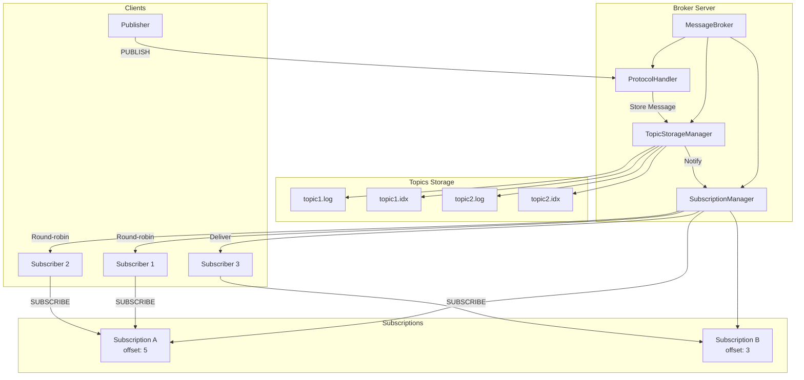
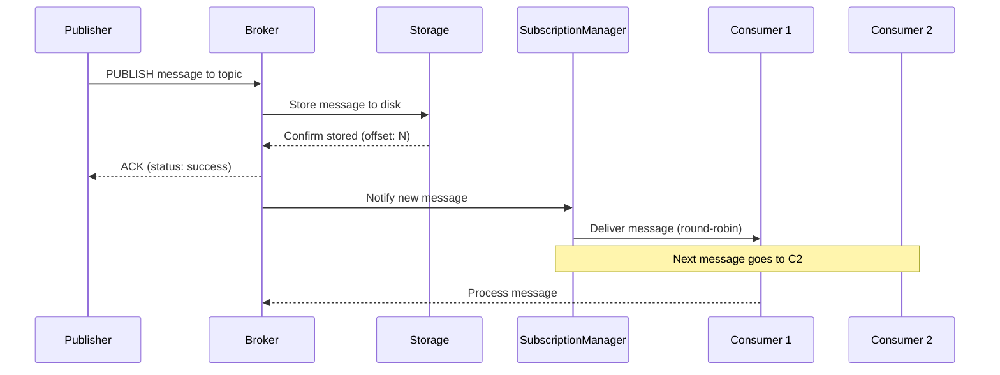

# Message Broker

A lightweight, subscription-based message broker with disk persistence, built in Python. This broker provides topic-based messaging with consumer groups (subscriptions) supporting publish-subscribe messaging patterns with round-robin delivery.

## Architecture



## Usage

### Starting the Server

```bash
python server.py
```

The server will start on `localhost:9999` by default.

### Client Usage

#### Publishing Messages

```python
from client import BrokerClient

# Create client
client = BrokerClient(host='localhost', port=9999, client_id='publisher-1')
client.connect()

# Create a topic
client.create_topic('events')

# Publish messages
client.publish_text('events', 'Hello, World!')
client.publish_text('events', 'Another message', custom_property='value')

client.disconnect()
```

#### Subscribing to Messages

```python
from client import BrokerClient

def message_handler(message):
    print(f"Received: {message.body.decode('utf-8')}")

# Create client
client = BrokerClient(host='localhost', port=9999, client_id='subscriber-1')
client.connect()

# Create a subscription for the topic
client.create_subscription('my-consumer-group', 'events', start_offset=0)

# Join the subscription
client.subscribe_to_subscription('my-consumer-group', handler=message_handler)

# Keep running to receive messages
try:
    while True:
        time.sleep(1)
except KeyboardInterrupt:
    client.unsubscribe_from_subscription('my-consumer-group')
    client.disconnect()
```

#### Multiple Subscribers (Round-robin)

```python
# Subscriber 1
client1 = BrokerClient(client_id='subscriber-1')
client1.connect()
client1.subscribe_to_subscription('my-consumer-group', handler=message_handler)

# Subscriber 2 (joins same subscription)
client2 = BrokerClient(client_id='subscriber-2') 
client2.connect()
client2.subscribe_to_subscription('my-consumer-group', handler=message_handler)

# Messages will be distributed round-robin between subscriber-1 and subscriber-2
```

### CLI Usage

```bash
# Create a topic
python client.py create-topic events --partitions 1

# Create a subscription
python client.py create-subscription my-group events --offset 0

# Publish a message
python client.py publish events "Hello World"

# Join a subscription to receive messages
python client.py join-subscription my-group

# Legacy subscribe (creates subscription automatically)
python client.py subscribe events --offset 0
```

## Message Flow



1. **Publisher** sends a message to a topic
2. **Broker** writes the message to disk and gets an offset
3. **Broker** sends ACK back to publisher
4. **Broker** notifies SubscriptionManager of new message  
5. **SubscriptionManager** delivers message to subscribers in round-robin fashion
6. **Subscribers** process messages independently

## Message Format

Messages use a binary format with the following structure:

```
[4 bytes: total_length][4 bytes: message_type][8 bytes: sequence_number]
[8 bytes: timestamp][4 bytes: properties_length][properties_data]
[4 bytes: body_length][body_data]
```

Message components:
- **Properties** - Key-value metadata pairs (encoded as key=value\x00)
- **Body** - Binary message data
- **Sequence Number** - Auto-assigned offset within topic  
- **Timestamp** - Message creation time in milliseconds
- **Message Type** - Operation type (DATA, ACK, PUBLISH, etc.)

## Configuration

Configuration is managed via `core/config.py` with environment variable support:

```python
# Server settings
server.host = '127.0.0.1'
server.port = 9999
server.heartbeat_interval = 30

# Storage settings  
storage.data_dir = './storage/data'
storage.fsync_on_write = True

# Client settings
client.request_timeout = 30
client.heartbeat_interval = 30
```

Environment variables (with `QB_` prefix):
- `QB_SERVER_HOST`, `QB_SERVER_PORT`
- `QB_DATA_DIR`, `QB_LOG_LEVEL`

## Storage

- **Sequential Storage**: Each topic has `.log` (messages) and `.idx` (offsets) files
- **Immediate Persistence**: Messages written to disk upon arrival with fsync
- **Offset Indexing**: Fast random access via binary offset index  
- **No Partitioning**: Single log file per topic for simplicity
- **Subscription Offsets**: Each subscription tracks its own consumption position

## Protocol

The broker uses a custom TCP protocol with the following message types:

- `CREATE_TOPIC` - Create a new topic
- `PUBLISH` - Publish message to topic  
- `CREATE_SUBSCRIPTION` - Create consumer group
- `DELETE_SUBSCRIPTION` - Remove consumer group
- `SUBSCRIBE` - Join a subscription
- `UNSUBSCRIBE` - Leave a subscription
- `HEARTBEAT` - Keep connection alive
- `ACK` - Acknowledge operations
- `DATA` - Delivered message

## Testing

Run the test suite:

```bash
python -m pytest tests/
# or
python -m unittest discover tests/
```

